# Frontier Furnitures

An online furniture shop that allows users to check for various furniture available at the online store and can purchase furniture online. The project consists of list of furniture products displayed in various models and designs. The user may browse through these products as per categories. If the user likes a product, he may add it to his shopping cart. Once the user wishes to checkout, he must register on the site first. He can then login using same id and password next time. Payment can be made through a credit card or cash on delivery. Once the user makes a successful transaction, he gets a copy of the shopping receipt on his email id. Here we use either HTML/CSS framework to make the entire frontend. The middle tier or code behind model is designed in PHP. SQL serves as a backend to store furniture lists and inventory data. Thus, the online furniture shopping project brings an entire furniture shop online and makes it easy for both buyer and seller to carry out furniture deals.

  

## Necessity of the Project
The intention of this project is to make it as comfortable and pleasant for our users as possible. Through this project, our customers can shop through our catalogue in the comforts of their home with no restrictions on time. Our website will be accessible 24x7.

   A few benefits of the online furniture store are that:

•	We provide cost effective goods,
•	A wide array of selection from our premium catalogue,
•	Discounts on large number of products,
•	Free shipment and
•	Reduced Stress Factor

  

## Entity - Relationship Diagram
The ER Diagram of the Project is given below which depicts the entities and their relationships with one another. It also describes the attributes of each entity implemented, along with common attributes that connect multiple entities.

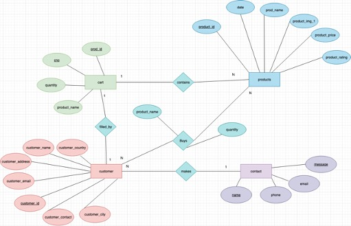

  

## Working Modules of the Project
### Customer Module
•	The main purpose of this module allows the customer to create an account with the company and then log in to the company website through the account details created.
•	This module is to provide all customer-related functionalities. For example, customer can view his orders and billing records.
•	It also tracks the information and details of the customers. It includes all the create, read, update and delete operations of the customers.

The features in this module are:  
•	Admin can add new customer records  
•	Admin can see the list of customer details 
•	Only admin can update and edit the record of the customers 
•	Admin will be able to delete the records of customers 

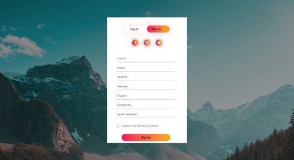
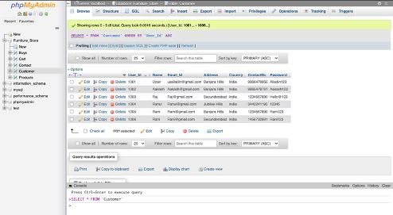

  

### Contact Us Module
•	The main purpose of this module is to allow the customer to contact the company and communicate to the company for any possible advice, change or collaboration.

The features of this Contact Us module are:   
•	Admin can view the contact list 
•	Admin can edit/delete the contact list
•	Customer can send any message to the admin
•	Customer can also give details about his/her name, email and phone number

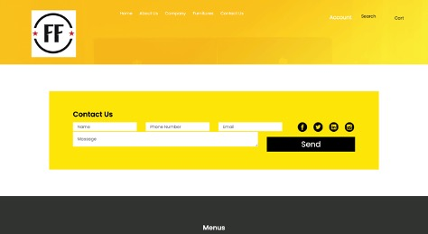
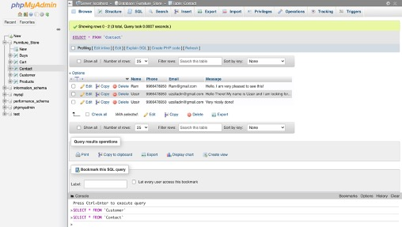

  

### Product Module: 
•	In this module, customer can view all the furniture list with name, image and description. If customer needs any customization, then they can share the ideas with any furniture design. Customer can order Beds, Tables, Sofas, etc. under customized order. The price will vary for each and every customization.

The features in this module are:   
•	Admin can manage the furniture  
•	Admin can edit/delete the furniture  
•	Admin can see the list of all furniture 
•	Customer can see furniture 

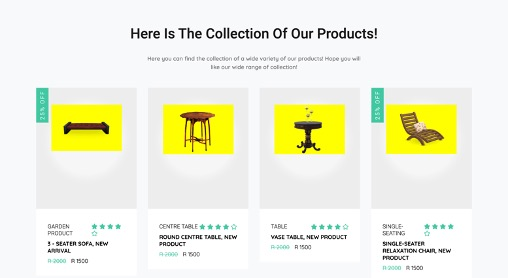
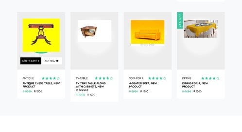
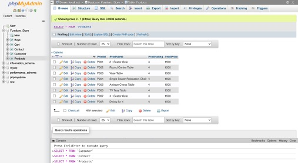

  

### Buys module :
•	In this module, customer can order for furniture. They can order multiple items together. After successful payment, the system displays the order reports. Finally, the customer can make payment through VISA, Debit card, Credit card, Cash on Delivery, etc.

The features in this module are:   
•	Admin can manage the order
•	Admin can edit/delete the order
•	Admin can see the list of all order
•	Customer can see his order

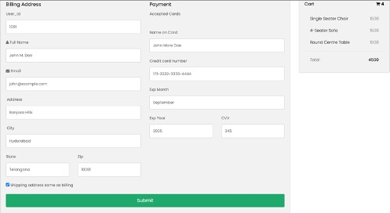
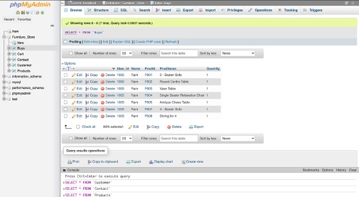

  

### Cart Module:
•	In this module, all the products that the customer stores in his/her cart can be viewed by the Admin and is all the essential information along with the product such as the cart number, the quantity, the price and the total amount for each product is calculated and displayed in the relation.

The features in this module are:   
•	Admin can view the cart products
•	Admin can edit the cart products
•	Admin can insert/delete any new cart products
•	Customer can view his/her cart products

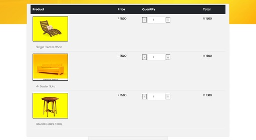
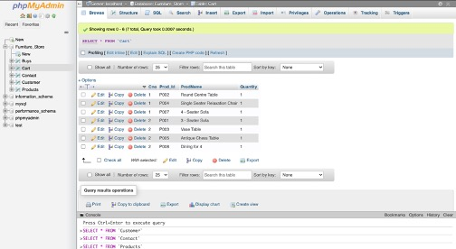

  

## Database Connectivity
This project utilises HTML for the creation of all the front-end web pages and PhpMyAdmin that consists of a built-in installer of the MySQL database and allows the user to connect the front-end and back-end part hosted by the Xampp application. Here, PHP basically connects the front-end html file with the back-end MySQL database. Xampp is an application server for hosting PHP but xampp contains the built-in installer of MySQL database. So when we install xampp server in our computer MySQL database is automatically installed in our computer. We have created 9 HTML files, 15 CSS files, and 4 PHP files in our project namely Buys.php, Customer.php, Connect.php, and Contact.php. These files are used to connect the html files to their respective relations in the MySQL database.
